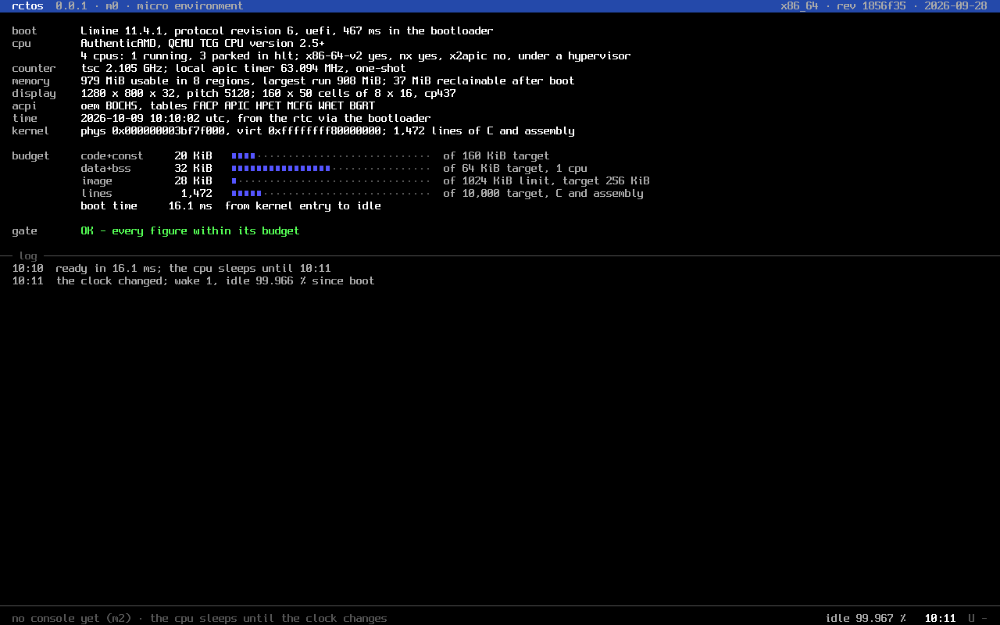

# rctos

rctos ist ein kleines Betriebssystem, das nicht auf Unix aufbaut. Es überträgt das
Paradigma seines Geschwisters RCP-OS auf PC- und ARM-Hardware: **viel erreichen mit wenig
Ressourcen**, in einer Mikro-Umgebung, die man ganz überblicken, messen und lesen kann.
Die Oberfläche ist eine Fensterschicht auf einem Raster von 8 × 8 Pixeln, mit dem
Zellenmodell von RCP-OS: Fenster rasten ein, jedes Fenster ist zugleich ein Terminal, und
neu gezeichnet wird nur, was sich ändert. Moderne Web-Darstellung liefert Chromium als
einziger großer Gast, in Fenstern oder im Vollbild. Dieselbe Basis soll auf
Embedded-Geräten und auf vollständigen Desktops laufen.

> **Status:** M0 ist erledigt. Der Kernel bootet in QEMU (UEFI und BIOS), zeigt seinen
> Boot-Bericht auf dem Bildschirm, prüft seine Budgets und schläft, bis sich die Uhr ändert.



## Eckdaten

| Thema | Festlegung | Stand M0 |
|---|---|---|
| Leitbild | Mikro-Welt klein, gemessen, inspizierbar; volle Kraft für den User-Space; Chromium ist der Gast und die eine Ausnahme | |
| Oberfläche | Fensterschicht der Mikro-Welt, 8 × 8-Zellen (Schrift `charmap01.png`), Zellenmodell 1:1 aus RCP-OS | Boot-Konsole in 8 × 8 |
| Kernel | Mikrokernel in C11, Image ≤ 1 MiB (Ziel ≤ 256 KiB), ≤ 10.000 Zeilen | 28 KiB, 1.472 Zeilen |
| RAM-Bedarf | Mikro-Welt ohne GUI und Netz im Leerlauf: ≤ 512 KiB resident | Kernel: 20 KiB Code, 32 KiB Daten |
| Multitasking | präemptiv, SMP, 32 feste Prioritätsstufen, tickless | Leerlauf: 1 Aufwachen pro Minute |
| Rechte | ausschließlich über Handles (Capabilities); kein Root im Kernel | |
| Auskunft | Systemzustand als Tabellen unter `/now`; Fehler bleiben als Exponate stehen | Panik-Bildschirm mit allen Registern |
| Direktzugriff | erlaubt, wenn ausdrücklich vergeben und widerrufbar (Framebuffer, IO-Ports) | |
| Treiber | laufen als Prozesse, austauschbar über Geräteklassen-Protokolle | |
| API | flache C-ABI in drei Kits; die Mikro-Welt braucht keine libc | |
| Konfiguration | eine Datei, `/sys/main.cfg` | |
| Dateisystem | `rcfs` aus der rcp-fs-Familie | |
| Erstes Ziel | x86-64 mit Intel-iGPU der Generationen Gen9 bis Gen12 | QEMU q35 |
| Eigentliches Ziel | ARM64 (AArch64) | |

## Schnellstart

Benötigt werden `clang`, `lld`, `python3`, `git`, `xorriso`, `qemu-system-x86` und `ovmf`
(Ubuntu 24.04: `apt install clang lld qemu-system-x86 ovmf xorriso`).

```sh
make          # Kernel bauen und Budget prüfen
make run      # Boot-Image bauen und in QEMU starten (Fenster, Log im Terminal)
make test     # ohne Fenster booten (UEFI und BIOS), Log prüfen, Bildschirmfotos in build/
```

Beim ersten `make run` holt `tools/fetch-limine.sh` den Bootloader in der festgelegten
Version und prüft ihn gegen `boot/limine.sha256`. Das ISO unter `build/` lässt sich auch
auf einen USB-Stick schreiben.

## Dokumente

| Nr. | Dokument | Inhalt |
|---|---|---|
| 00 | [Leitbild, Vision und Budgets](docs/00-vision.md) | Mikro-Welt und Gast, Leitsätze, Budgets, Familie RCP-OS, Entscheidungen |
| 01 | [Kernel](docs/01-kernel.md) | Objektmodell, Speicher ohne Overcommit, Scheduler, IPC, Auskunft, Exponate, Boot |
| 02 | [Syscalls und Kits](docs/02-syscalls-und-kits.md) | ABI, Nummernkreise, vollständige Aufrufliste, Stabilitätsregeln |
| 03 | [Rechte](docs/03-rechte.md) | Handle-Rechte, Ressourcen, Manifeste, Direktzugriff, Identität und Sitzungen |
| 04 | [Treibermodell](docs/04-treibermodell.md) | Gerätemanager, Matching, Protokolle, Austausch, Treiberpakete |
| 05 | [Grafik](docs/05-grafik.md) | zwei Welten auf einem Bildschirm, Anzeige- und GPU-Protokoll, Intel-iGPU, Mesa |
| 06 | [Chromium, der Gast](docs/06-chromium.md) | Regeln für den Gast, schlanke Einbettung, Portierung, Build, Pflege |
| 07 | [Roadmap](docs/07-roadmap.md) | Meilensteine mit Abnahmekriterien, M0 erledigt |
| 08 | [Plattformen](docs/08-plattformen.md) | x86-64 und AArch64, Boot mit Limine, Referenzmaschine, Referenz-Hardware |
| 09 | [Die Mikro-Welt](docs/09-mikro-welt.md) | `main.cfg`, Bodenkonsole, Prompt-Sprache, `/now`, Logs, Exponate, Systemoberflächen |
| 10 | [rcfs](docs/10-rcfs.md) | das Dateisystem aus der rcp-fs-Familie (Entwurf) |
| 11 | [Fensterschicht und Zellenmodell](docs/11-fenster.md) | Zellenmodell 1:1 aus RCP-OS, Fenster auf dem 8 × 8-Raster, Render-Instanzen, Energie |

## Verzeichnisse

```
kernel/            Mikrokernel (C11)
  core/            architekturunabhängiger Teil, budget.h
  arch/x86_64/     Architekturschicht x86-64 (einziger Ort für Assembler)
  boot/            Limine-Protokoll (limine.h)
boot/              Limine-Konfiguration und festgelegte Version
tools/             Budget, Codezeilen, Schrift, QEMU, Limine
docs/              Konzeptpapiere
LICENSES/          Lizenzen der übernommenen Teile (Limine)

geplant:
kits/              System-Kit, Treiber-Kit, User-Kit
services/          init, devmgr, console, login, fs, net
drivers/           uart16550, efifb, ps2, pci, virtio-*, xhci, intel-igpu, …
protocols/         Geräteklassen- und Dienstprotokolle (Header)
ports/             der Gast: Patches und Build für Chromium, Mesa, musl
```

## Konventionen

- Die Dokumente sind auf Deutsch, Bezeichner im Code auf Englisch.
- Implementierungssprache ist C11, kein Rust (siehe [00](docs/00-vision.md#entscheidungen)).
- Zeichenketten, die Bildschirm oder serielle Schnittstelle erreichen, sind ASCII;
  CP437-Zeichen oberhalb von 0x7F stehen als `\xNN` im Quelltext.
- Größenangaben sind binär: KiB, MiB, GiB.
- Kernel-Typen beginnen mit `rc_`, Aufrufe mit `sys_` (System-Kit), `drv_` (Treiber-Kit) oder
  `usr_` (User-Kit).
- Budgets stehen in `kernel/core/budget.h` und in [00](docs/00-vision.md#budgets); beide
  ändern sich nur gemeinsam.
